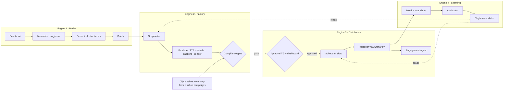

# 00 · Overview, architecture, and canonical registry

> **Read this first.** Every other plan doc references the names, enums, and conventions defined here. If a doc and this registry disagree, this registry wins — fix the other doc.

## 1. What we are building

**Viral Engine** — a 24/7 system that (1) watches Reddit, X, TikTok and YouTube for what's going viral per category, (2) turns hot trends into **original** platform-native content with LLMs, (3) publishes across all four platforms on schedule after human approval, and (4) learns from its own analytics to improve. Revenue comes from licensed clipping campaigns (day 1), affiliate links, and platform monetization programs (months in).

**Product context and constraints** live in [`/INITIAL_RESEARCH.md`](../../INITIAL_RESEARCH.md). The non-negotiables the research imposed on this design:

- We **never** publish third-party footage/music. The Compliance gate blocks it. Rights classes: `green` (execute the idea originally), `amber` (quotable with genuine commentary), `red` (radar intelligence only, never publish).
- TikTok/YouTube publishing goes through **Ayrshare** (audited apps) — not direct platform APIs.
- X reads are **pay-per-use** ($0.005/post) — the Radar filters hard before reading.
- Every post that goes out passes an **approval** (Telegram group + dashboard) until a category/format earns auto-approval.
- AI-generated visuals set the platform **AI-disclosure flags**.
- Politics category = human approval forever. Music category = radar-only, publishing disabled.

## 2. The four components (engines)



The **harness** (job queue, cron, agent runner, kill-switch — doc 08) is the substrate all four engines run on. The **API** (doc 11), **dashboard** (doc 10), and **Telegram bot** (doc 09) are the human surfaces.

## 3. Tech stack (decided — do not relitigate in code)

| Concern | Choice | Rationale |
|---|---|---|
| Runtime | **Bun ≥ 1.2**, TypeScript 5.x `strict` | Runs TS natively, fast, single toolchain |
| Monorepo | **Bun workspaces** (no Turbo/Nx) | Small team, simple graph |
| API | **Hono** on `Bun.serve` | Per user requirement; fast, typed |
| Validation | **Zod** everywhere (env, API bodies, LLM outputs, queue payloads) | One schema language |
| DB | **Postgres 16**, **Drizzle ORM** + `drizzle-kit` migrations, `postgres` (postgres.js) driver | Typed schema-as-code |
| Job queue + cron | **pg-boss v10** (Postgres-backed) | No Redis to operate; cron built in; retries/backoff/dead-letter built in |
| Object storage | **Cloudflare R2** via S3 API (`@aws-sdk/client-s3`); **MinIO** in local dev | Per user requirement |
| LLMs | `@anthropic-ai/sdk` (Claude — editorial/scripts/compliance/judgment) · `@google/genai` (Gemini Flash — video understanding, embeddings, batch scoring) · Groq SDK (`whisper-large-v3-turbo` transcription) | Cost-fit per job (see research §06) |
| TTS | ElevenLabs API (primary) · OpenAI `gpt-4o-mini-tts` (cheap fallback) | Research §05 pricing |
| Rendering | **FFmpeg ≥ 6 with libass** (v1: templated filtergraph pipeline) · Remotion documented as v2 option | No headless Chrome to operate in v1 |
| Posting | **Ayrshare** (TikTok/YouTube/Reddit/X writes) · direct X API optional later | Sidesteps platform app audits |
| Telegram | **grammY** (long-polling process) | Works behind NAT, no webhook TLS needed; webhook alt documented |
| Dashboard | **Vite + React 19 + TanStack Router + TanStack Query + Tailwind v4 + Recharts** | Boring, fast to build |
| Lint/format | **Biome** | One tool |
| Logging | **pino** (JSON logs), pretty in dev | Structured, cheap |
| IDs | **UUIDv7** (`uuidv7` npm package, generated app-side) | Time-sortable, index-friendly |
| Time | Store **UTC** (`timestamptz`); display in `Asia/Kolkata` (dashboard + TG) | User is IST |

## 4. Monorepo layout (canonical)

```
just-some-social-media-thing/
├─ package.json                 # workspaces root, scripts
├─ bunfig.toml
├─ tsconfig.base.json
├─ biome.json
├─ docker-compose.dev.yml       # postgres + minio
├─ .env.example                 # every env var, documented (doc 01 §6)
├─ INITIAL_RESEARCH.md
├─ docs/plan/                   # these documents
├─ apps/
│  ├─ api/                      # Hono server: REST /api/v1, session auth, serves dashboard build in prod
│  ├─ workers/                  # pg-boss consumers + cron registration (all engines' jobs)
│  ├─ bot/                      # grammY long-polling approval bot process
│  └─ dashboard/                # Vite React SPA
└─ packages/
   ├─ config/                   # zod-validated env loader (@ve/config)
   ├─ core/                     # domain types, enums, state machines, queue payload schemas, constants (@ve/core)
   ├─ db/                       # drizzle schema, client, migrations, seed (@ve/db)
   ├─ storage/                  # R2 client, key conventions, presign helpers (@ve/storage)
   ├─ llm/                      # model clients, prompts, structured-output runner, embeddings, cost meter (@ve/llm)
   ├─ connectors/               # reddit, youtube, x, tiktokData (apify/ensemble), ayrshare, pexels (@ve/connectors)
   ├─ telegram/                 # bot composition, approval cards, alert sender (@ve/telegram)
   └─ media/                    # ffmpeg wrappers, ass-caption builder, render templates, fonts (@ve/media)
```

Package scope is **`@ve/`**. Apps import packages with `workspace:*`. No app imports another app. `@ve/core` has zero runtime deps besides zod; everything may depend on it; it depends on nothing internal.

## 5. Canonical registry

### 5.1 Queue names (pg-boss)

| Queue | Producer | Consumer app | Purpose |
|---|---|---|---|
| `scout.reddit` / `scout.youtube` / `scout.x` / `scout.tiktok` | cron | workers | Pull category feeds → upsert `raw_items` + `item_snapshots` |
| `radar.score` | scouts (batch complete) | workers | Velocity stats + LLM rubric → `trend` scoring |
| `radar.cluster` | after score | workers | Embedding dedupe → `trends` + `trend_members` |
| `radar.digest` | cron 2×/day | workers | TG digest of top trends |
| `factory.brief` | cron hourly (Editor-in-chief) | workers | Pick trends → create `briefs` |
| `factory.script` | brief created | workers | Scriptwriter agent → `scripts` |
| `factory.tts` · `factory.visuals` · `factory.captions` | script approved by gate | workers | Produce `assets` |
| `factory.render` | assets ready | workers | FFmpeg → `renders` per platform |
| `factory.compliance` | pre-render + pre-publish | workers | Blocking checks → `compliance_checks` |
| `clip.transcribe` · `clip.analyze` · `clip.cut` | long_form/campaign ingested | workers | Clipping pipeline |
| `approval.request` | render passed compliance | workers | Create `approvals`, send TG card |
| `approval.remind` | cron hourly | workers | Nudge stale pending approvals |
| `publish.plan` | cron daily 00:30 IST | workers | Fill next-day slots per platform/category |
| `publish.execute` | scheduled (`startAfter`) | workers | Call Ayrshare/X → `posts` update |
| `publish.verify` | 10 min after execute | workers | Confirm live, store permalink/external id |
| `engage.scan` | cron */20min for posts <3h old | workers | Fetch comments → `engagements` |
| `engage.reply` | scan output (gated) | workers | Draft/send replies |
| `metrics.snapshot` | cron: +3h, +24h post-publish, then daily 06:00 IST | workers | `post_snapshots` |
| `learn.attribute` | cron weekly Mon 07:00 IST | workers | Feature attribution report |
| `playbook.update` | after attribute | workers | New `playbook_versions` draft |
| `policy.watch` | cron monthly 1st | workers | Diff the 12 policy pages → TG alert |
| `costs.rollup` | cron daily 05:00 IST | workers | Aggregate `llm_usage`+`api_usage` |
| `alert.telegram` | anyone | workers | Fire-and-forget ops alerts |

### 5.2 Status enums (single source: `@ve/core/enums.ts`)

```ts
export const RIGHTS_CLASS = ['green', 'amber', 'red'] as const;
export const TREND_STATUS = ['active', 'briefed', 'expired', 'suppressed'] as const;
export const BRIEF_STATUS = ['draft', 'scripted', 'producing', 'blocked', 'ready', 'abandoned'] as const;
export const ASSET_KIND = ['tts_audio', 'image', 'broll_video', 'captions_ass', 'thumbnail', 'source_video'] as const;
export const RENDER_STATUS = ['pending', 'rendering', 'done', 'failed'] as const;
export const APPROVAL_STATUS = ['pending', 'approved', 'rejected', 'edit_requested', 'expired', 'auto_approved'] as const;
export const POST_STATUS = ['draft', 'awaiting_approval', 'approved', 'scheduled', 'publishing', 'published', 'failed', 'deleted'] as const;
export const PLATFORM = ['reddit', 'youtube', 'x', 'tiktok'] as const;
export const CATEGORY_MODE = ['full_auto_candidate', 'human_gated', 'radar_only'] as const; // politics=human_gated forever, music=radar_only
```

Allowed transitions are defined as maps in `@ve/core/stateMachines.ts` and enforced in DB-update helpers (doc 02 §5). Any transition not listed throws.

### 5.3 Table names (full schema in doc 02)

`categories, sources, raw_items, item_snapshots, trends, trend_members, briefs, scripts, assets, renders, compliance_checks, approvals, approval_events, posts, post_snapshots, engagements, long_forms, clip_candidates, campaigns, campaign_clips, playbook_versions, policy_pages, agent_runs, llm_usage, api_usage, settings, admin_users, sessions`

### 5.4 API route prefix

All REST under **`/api/v1`** (doc 11). Auth: session cookie (dashboard) or `Authorization: Bearer ${ADMIN_API_TOKEN}` (bot/workers/CLI).

### 5.5 R2 key conventions (`@ve/storage`)

```
assets/{briefId}/{assetId}.{ext}         # tts mp3, images, captions .ass
renders/{briefId}/{renderId}_{platform}.mp4
longforms/{longFormId}/source.mp4
longforms/{longFormId}/clips/{clipId}.mp4
campaigns/{campaignId}/source/{fileId}.mp4
thumbs/{renderId}.jpg
```

Dashboard/TG previews use presigned GET URLs (1 h TTL). Ayrshare receives presigned URLs (24 h TTL) at publish time.

## 6. External accounts the human must create (one-time, before Phase 1)

Coding agents: never block on these — stub with fixtures and mark the integration `disabled_until_credentialed` in `settings`.

| # | Service | What to create | Env vars |
|---|---|---|---|
| 1 | Postgres | Local via docker-compose; prod: managed PG 16 | `DATABASE_URL` |
| 2 | Cloudflare R2 | Bucket `viral-engine`, S3 API token | `R2_ACCOUNT_ID, R2_ACCESS_KEY_ID, R2_SECRET_ACCESS_KEY, R2_BUCKET` |
| 3 | Anthropic | API key | `ANTHROPIC_API_KEY` |
| 4 | Google AI Studio | API key (Gemini) | `GEMINI_API_KEY` |
| 5 | Groq | API key (Whisper) | `GROQ_API_KEY` |
| 6 | ElevenLabs | API key (Creator plan) | `ELEVENLABS_API_KEY` |
| 7 | OpenAI (optional) | API key (mini-TTS fallback) | `OPENAI_API_KEY` |
| 8 | Reddit | "script"-type app at reddit.com/prefs/apps (read-only use) | `REDDIT_CLIENT_ID, REDDIT_CLIENT_SECRET, REDDIT_USER_AGENT` |
| 9 | Google Cloud | Project + YouTube Data API v3 key (read-only use) | `YOUTUBE_API_KEY` |
| 10 | X Developer | Account + prepaid credits (reads) | `X_BEARER_TOKEN` |
| 11 | Apify | Token; rent TikTok scraper actor | `APIFY_TOKEN` |
| 12 | Ayrshare | Account (Premium), link the 4 platform accounts to a profile | `AYRSHARE_API_KEY, AYRSHARE_PROFILE_KEY` |
| 13 | Telegram | Bot via @BotFather; create approval group; add bot as admin; get chat id | `TELEGRAM_BOT_TOKEN, TELEGRAM_APPROVAL_CHAT_ID, TELEGRAM_ALERT_CHAT_ID, TELEGRAM_ADMIN_USER_IDS` |
| 14 | Pexels | API key (licensed stock) | `PEXELS_API_KEY` |
| 15 | Whop | Creator account, join Content Rewards campaigns (manual; campaign metadata entered via dashboard Settings) | — |

## 7. Cross-cutting conventions

- **Errors:** every worker job wraps in try/catch; on final retry failure → `alert.telegram` with job name + id + message. Never swallow.
- **Idempotency:** scouts upsert on `(platform, external_id)`; queue sends use `singletonKey` where re-enqueue is possible (noted per job in engine docs).
- **Money:** every LLM call goes through `@ve/llm` `metered()` wrapper → `llm_usage` row; every paid HTTP connector logs `api_usage`. `costs.rollup` enforces `COST_BUDGET_MONTHLY_USD` — at 80% send TG warning, at 100% flip kill-switch for non-critical queues (everything except `metrics.snapshot`, `alert.telegram`).
- **Kill-switch:** `settings.kill_switch = 'true'` blocks `publish.*`, `engage.reply`, `approval.request` at job start (doc 08 §6). Toggle via dashboard Settings + TG `/kill` command.
- **Secrets** never in DB; env only. `@ve/config` refuses to start with missing/invalid vars (except integrations explicitly optional).
- **Logging fields:** `{ job, jobId, entity, entityId, category, platform }` on every log line where applicable.

## 8. Doc index (build in this order)

| Doc | Contents |
|---|---|
| [01-monorepo-and-tooling](01-monorepo-and-tooling.md) | Workspace setup, tsconfig, biome, docker-compose, `.env.example`, scripts, CI |
| [02-database](02-database.md) | Full Drizzle schema, migrations, state-machine enforcement, seed |
| [03-shared-packages](03-shared-packages.md) | `@ve/config, core, storage, llm, connectors, telegram, media` contracts |
| [04-engine-radar](04-engine-radar.md) | Scouts, normalization, scoring, clustering, briefs, digest |
| [05-engine-factory](05-engine-factory.md) | Scripts, TTS, visuals, captions, render, clipping pipeline, compliance gate |
| [06-engine-distribution](06-engine-distribution.md) | Ayrshare, scheduler, metadata, publish state machine, engagement |
| [07-engine-learning](07-engine-learning.md) | Metrics snapshots, attribution, playbooks, weekly digest |
| [08-harness-orchestration](08-harness-orchestration.md) | pg-boss setup, cron table, agent runner, kill-switch, policy watch, budget guard |
| [09-approvals-and-telegram](09-approvals-and-telegram.md) | Approval state machine, **full grammY bot code**, dashboard parity |
| [10-dashboard](10-dashboard.md) | Pages, components, charts, auth, API consumption |
| [11-api](11-api.md) | Full route inventory, middleware, webhooks, SSE note |
| [12-infra-deploy](12-infra-deploy.md) | Dev/prod topology, VPS deploy, backups, monitoring, R2 setup |
| [13-build-order-and-testing](13-build-order-and-testing.md) | Phases with acceptance criteria, testing strategy, fixtures, CI gates |

## 9. Glossary

- **Trend** — a clustered story/meme/topic detected across ≥1 platform, scored for velocity + transferability.
- **Brief** — an editorial decision to execute a trend: angle, format, target platforms, category.
- **Render** — one platform-specific output video/image set produced from a brief's assets.
- **Post** — one platform-specific publication attempt of a render (a brief usually yields 2–4 posts).
- **Playbook** — versioned markdown per category that the Scriptwriter/Scheduler read; updated weekly by Engine 4.
- **Qualified slot** — a scheduled posting window respecting platform cadence caps + playbook timing.
